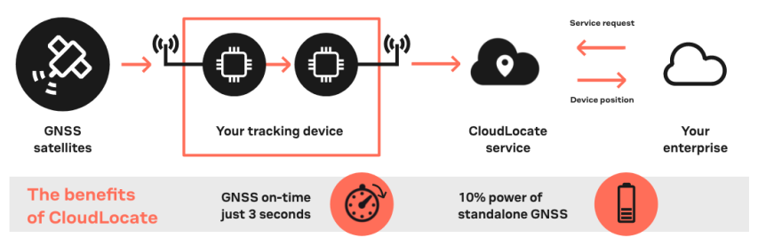
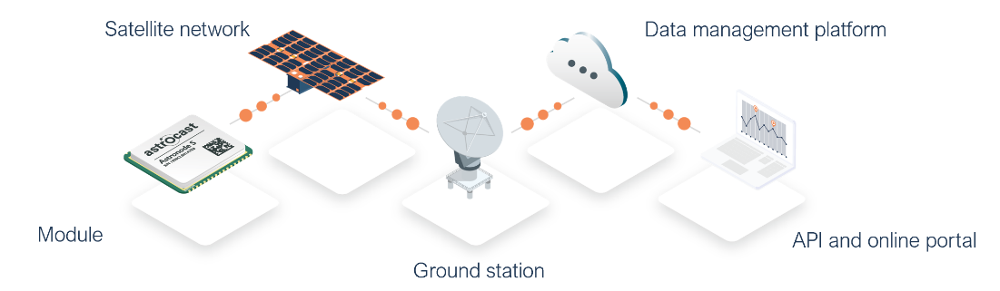
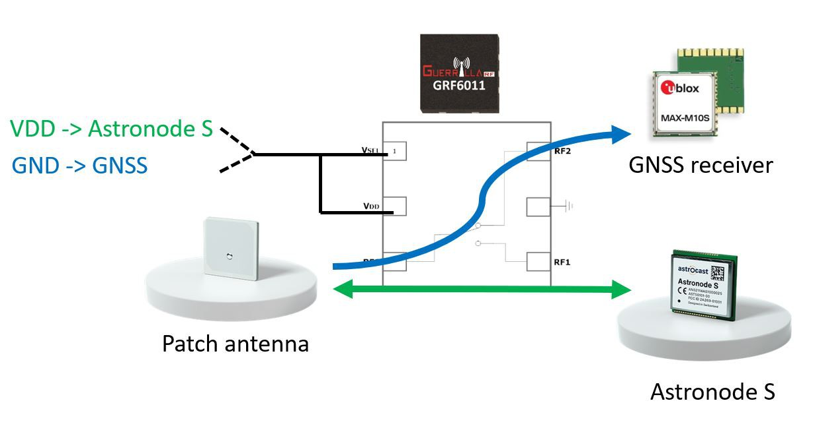
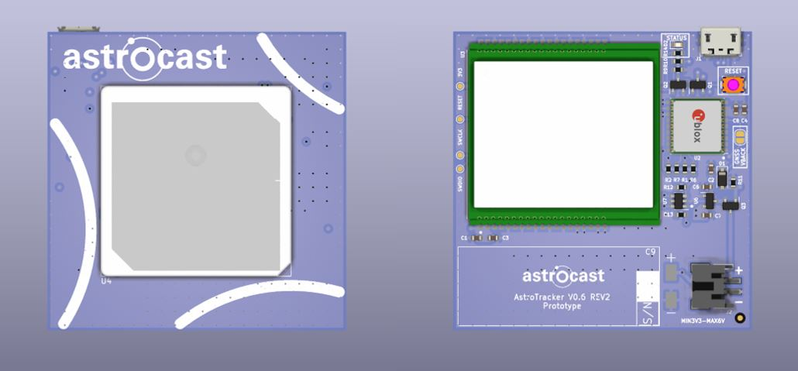

# AstroTracker

A tracker that can transmit your location anywhere on Earth ? Even when there is no terrestrial network such as 2G, 4G, 
LoRa, etc. to relay your data ? A tracker that can acquire and transmit a location with only 10 joules of energy consumed 
(Yes, this is nothing !) ? A tracker that measures only 55x55x10mm ? A tracker that weight only 44g (with battery !) ? 
A tracker that can operate for at least 8 months when sending 1 location per day ? Sounds impossible ? Believe it or not, 
but YES, this is possible and fortunately, you will find plenty of details in this page to build your own!

The project is also on HACKADAY: https://hackaday.io/project/189798-astrotracker-mini 

## Principle of operation

The principle of operation is relatively simple: the GPS data are collected thanks to an ultra-low power GNSS receiver 
from u-blox and a satellite communication module from Astrocast is used to transmit the data to the cloud. 

The GNSS receiver used on the tracker is a [MAX-M10S](https://www.u-blox.com/en/product/max-m10-series) from u-blox. 
It outputs a raw sample of data that we can upload to a server of u-blox which will then return the 3D location of the 
tracker.
In good sky visibility, the receiver can start to output these raw messages in just 3 seconds, which is much shorter 
(and thus energy efficient), than going for a full PVT acquisition (up to 28 seconds for a cold start).

The following schematic summarizes well the overall acquisition process:

Follow [this link](https://www.u-blox.com/en/product/cloudlocate) if you want to learn more on the "CloudLocate" 
service from u-blox.

So how do we transmit our raw sample of data to the server ? Well, it's now that we have to give some more details on 
the satellite communication module from Astrocast: 
the [Astronode S](https://docs.astrocast.com/docs/products/astronode-s/).

The Astronode S is a low power bi-directional satellite communication module which uses the L-band frequency band to 
communicate with the satellites. Once the raw GNSS sample is acquired, the tracker will place it in the message queue of 
the Astronode S and the module will automatically look for a satellite from the Astrocast constellation. 
When a satellite is in view, the module will transmit the data that will then appear on the 
[Astrocast portal](https://portal.astrocast.com/).

The following schematic summarizes the overall data upload process:

Follow [this link](https://www.astrocast.com/) if you want to learn more on the service from Astrocast.

In the schematics of the tracker, you will see that the Astronode S and GNSS receiver share the same 
[patch antenna](https://www.astrocast.com/products/astronode-patch-antenna/) as they are working in the same frequency 
range (1.5 - 1.6 GHz).  The RF switch that has been selected is a 
[GRF6011](https://www.guerrilla-rf.com/products/detail/sku/GRF6011) from Guerrilla RF. 
Its fail safe feature enables a good low power solution: when the RF switch is not powered, one of the two RF path will 
present low insertion losses (<0.4 dB). When the switch is powered, the second RF path will instead go in a low 
insertion loss state as illustrated below:

This solution allows to keep the GNSS RF path active when the RF switch is turned off. When the Astronode S wants to use 
the antenna, its "ANTN_USE" pin of the module will power up the RF switch and connect the Astronode S to the antenna.

## Tracker "fact sheet"

The main features of the tracker are listed below:

- GNSS "snapshot" mode (u-blox MEAS20 messages for M10 receivers - data will be processed on CloudLocate service.
- Single shared antenna for satellite communication AND GNSS acquisition.
- Remotely configurable thanks to satellite downlink (user can set the tracker configuration such as acquisition rates).
- Real-time scheduler (GNSS/sensors acquisition, generate status reports, etc.).

Some key technical aspects are listed below:

- Framework: Arduino core for SAMD21.
- GNSS module: MAX-M10S from u-blox (L1 band: 1.575 GHz).
- Communication module: Astronode S from Astrocast
  - Downlink frequency: 1525-1559 MHz
  - Uplink frequency: 1626.6-1660.5 MHz
- RF switch:  GRF6011 from Guerrilla RF
- PCB substrate: FR4, 4 layers
- Connectors:
  - 2 pin JST connector for wired battery.
  - USB interface for programming.

Some facts on latency and acquisition rates:

- GPS acquisition rate: from 1 sample per day up to 1 sample per hour.
- Message end-to-end latency: a few hours (depends on the location of the tracker).

## Hardware versions

Multiple hardware variants of the tracker are available depending on the use case. Note that the same source code is 
used for all the versions by activating, deactivating the modules that needs to be used:

### AstroTracker V0.3 REV1

Internal name: AstroAnimal

Coming soon !

### AstroTracker V0.4 REV1

Internal name: AstroPager

Coming soon !

### AstroTracker V0.5 REV3

Internal name: AstroTrackerOne

Coming soon !

### AstroTracker V0.6 REV2

Internal name: MiniTracker

- U-blox MAX-M8/10 GNSS receiver, **shared antenna** with Astronode S communication module.
- MCU is SAM2121G18A, integrated below the Astronode S module (Astronode S is mounted on a PCB spacer).
- Astronode S + patch antenna communication module.
- Hardware watchdog using [TPL5010](https://www.ti.com/product/TPL5010)
- 2 pin JST connector for wired battery.
- Connectors: USB interface.
- **55x55mm**, 4 layers PCB design.

### AstroTracker V0.7 REV1

Internal name: AstroTrackerMesh

Coming soon !

## Tracker to Operator - Message format

All the data acquired by the tracker are managed by a logger. A new log entry will be generated for each GNSS 
measurement, user uplink command, user downlink message, etc. The list of possible log entries is provided in the 
following table:

#### Message ID

List of message types that are stored in the logger of the tracker.

|Message|ID|Length (Bytes)|Description|
|---|---|---|---|
|LOGGER_TAG_PVT_SLOT|0x01|20|Logger GNSS PVT message|
|LOGGER_TAG_U_MSG_SLOT|0x02|41|Logger user message - Uplink message with text|
|LOGGER_TAG_RAW_SLOT|0x04|21|Logger GNSS RAW message|

#### <code>LOG_PVT_struct</code> Logger GNSS PVT message

This structure contains the position, velocity and time (PVT) data generated by the GNSS receiver. 

|Byte offset|Type|Length (Bytes)|Name|Description|
|---|---|---|---|---|
|0|uint8_t|1|slot_tag|Message ID|
|1|uint32|4|Timestamp|Epoch of the measurement in UNIX time|
|5|int32|4|Latitude|Degrees Latitude * 1E7 (i.e., latitude multiplied by 10'000'000)|
|9|int32|4|Longitude|Degrees Longitude * 1E7 (i.e., longitude multiplied by 10'000'000)|
|13|uint8|1|SIV|Number of satellites used in fix|
|14|int32_t|4|gSpeed|Ground speed in mm/s|
|18|uint8|1|V Bat|Voltage of the battery in the tracker (multiplied by 10)|
|19|int8|1|Temperature|Temperature of the tracker in deg C (1 deg resolution)|

#### <code>LOG_RAW_struct</code> Logger GNSS RAW message

This structure contains the RAW data that can be uploaded to the CloudLocate service from U-blox to compute the location 
of the tracker. Do not forget to add the timestamp "created date" provided by the satellite communication module.

|Byte offset|Type|Length (Bytes)|Name|Description|
|---|---|---|---|---|
|0|uint8_t|1|slot_tag|Message ID|
|1|uint8_t|20|meas20|U-blox MEAS20 message|

#### <code>LOG_U_MSG_struct</code> Logger user message

This structure contains the text message queued by the user. This message can be directly read on the Astrocast portal.

|Byte offset|Type|Length (Bytes)|Name|Description|
|---|---|---|---|---|
|0|uint8_t|1|slot_tag|Message ID|
|1|uint8_t|40|data|User message data|

## Operator to Tracker - Command format

The tracker can execute a certain amount of commands trough the different available communication interfaces (Satellite, BLE, Mesh).
Here is the description of the transport layer. 
The protocol is inspired from the protocol used to communicate with the products from 
[Advanced Navigation](https://www.advancednavigation.com/)

<table>
    <thead>
        <tr>
            <th colspan="4">Header</th>
            <th>Data</th>
        </tr>
    </thead>
    <tbody>
        <tr>
            <td>Header LRC</td>
            <td>Packet ID</td>
            <td>Packet Length</td>
            <td>CRC16</td>
            <td>Packet Data</td>
        </tr>
    </tbody>
</table>

A description of each field is provided in the following table:

|Byte offset|Type|Length (Bytes)|Name|Description|
|---|---|---|---|---|
|0|uint8_t|1|Header LRC|Longitudinal Redundancy Check.   Error checking for the packet header.    LRC = ((packet_id + packet_length + crc[0] + crc[1])^0xFF) + 1|
|1|uint8_t|1|Packet ID|Used to distinguish the contents of the packet. IDs can be in the range 0-255.|
|2|uint8_t|1|Packet Length|Length of the data packet, from byte offset 5 included. Length can be in the range 0-255.|
|3|uint16_t|2|CRC16|CRC, CRC16-CCITT (start us 0xFFFF). Computed only over the data packet.|

The list of supported packet IDs and their description is provided below:

|Packet ID|Length|R/W|Description|
|---|---|---|---|
|0|4|R|Acknowledge packet|
|1|Varies|W|Request packet|
|2|44|R/W|Message data packet|
|3|43|R|Satellite status packet|
|4|8|R|Logger status packet|
|5|18|R|GPS status packet|
|6|6|R|BLE status packet|
|7|8|R|Asset status packet|
|11|8|W|Configuration packet|

#### <code>packet_id_acknowledge</code> Acknowledge packet

    typedef struct __attribute__((__packed__))
    {
        uint8_t packet_id;
        uint16_t packet_crc;
        uint8_t acknowledge_result;
    } acknowledge_packet_t;

#### <code>packet_id_msg_data</code> Message data packet

    typedef struct __attribute__((__packed__))
    {
        uint8_t data[40];
        uint32_t acknowledgedDate;
    } msg_data_packet_t;

#### <code>packet_id_sat_status</code> Satellite status packet

    typedef struct __attribute__((__packed__))
    {
        uint32_t sat_detect_operation_cnt;
        uint32_t signal_demod_attempt_cnt;
        uint32_t ack_demod_attempt_cnt;
        uint32_t sent_fragment_cnt;
        uint32_t ack_fragment_cnt;
        uint32_t queued_msg_cnt;
        uint32_t time_start_last_contact;
        uint32_t time_end_last_contact;
        uint8_t peak_rssi_last_contact;
        uint32_t time_peak_rssi_last_contact;
        uint16_t reset_cnt;
        uint32_t uptime;
    } sat_status_packet_t;

#### <code>packet_id_logger_status</code> Logger status packet

    typedef struct __attribute__((__packed__))
    {
        uint16_t u_msg_cnt;
        uint16_t u_cmd_cnt;
        uint16_t pvt_cnt;
        uint16_t raw_cnt;
    } logger_status_packet_t;

#### <code>packet_id_gps_status</code> GPS status packet

    typedef struct __attribute__((__packed__))
    {
        uint16_t meas_cnt;
        int32_t last_loc_lat;
        int32_t last_loc_lon;
        uint32_t time_last_update;
        uint32_t uptime;
    } gps_status_packet_t;

#### <code>packet_id_ble_status</code> BLE status packet

    typedef struct __attribute__((__packed__))
    {
        uint32_t advert_burst_cnt;
        uint16_t user_connection_cnt;
    } ble_status_packet_t;

#### <code>packet_id_asset_status</code> Asset status packet

    typedef struct __attribute__((__packed__))
    {
        uint32_t up_time_ms;
        uint32_t sys_time;
    } asset_status_packet_t;

#### <code>packet_id_config</code> Configuration packet

    typedef struct __attribute__((__packed__))
    {
        // GPS config
        bool gps_settings_with_gps;
        bool gps_settings_with_galileo;
        bool gps_settings_with_beidou;
        bool gps_settings_with_glonass;
        bool gps_settings_with_rxm_meas20;
        uint8_t gps_settings_raw_timeout_s;
    
        // sat modem config
        bool sat_settings_with_pld_ack;
        bool sat_settings_with_geo_loc;
        bool sat_settings_with_ephemeris;
        bool sat_settings_with_deep_sleep_en;
        bool sat_settings_with_msg_ack_pin_en;
        bool sat_settings_with_msg_reset_pin_en;
        bool sat_settings_with_cmd_event_pin_en;
        bool sat_settings_with_tx_pend_event_pin_en;
        bool sat_settings_sat_force_search;
        uint8_t sat_settings_sat_search_rate;
    
        // Scheduler config
        uint8_t scheduler_settings_gps_interval_h;
        uint8_t gps_settings_pvt_timeout_s;
    
        // Asset status
        uint8_t battery_low_threshhold;
    
    } config_packet_t;

The following table explains which commands are available for which communication interface:

|Packet ID|Packet Name|Satellite|BLE|Mesh|
|---|---|---|---|---|
|0|Acknowledge packet|❌|✅|❌|
|1|Request packet|❌|✅|❌|
|2|Message data packet|✅|✅|❌|
|3|Satellite status packet|❌|✅|❌|
|4|Logger status packet|❌|✅|❌|
|5|GPS status packet|❌|✅|❌|
|6|BLE status packet|❌|✅|❌|
|7|Asset status packet|❌|✅|❌|
|11|Configuration packet|✅|✅|❌|

## Android app

An Android app allows the user to execute the above listed commands on the tracker thanks to BLE capabilities of the 
NRF52840. 

Coming soon !

## Copyright

AstroTracker Copyright (C) 2023 valcesch

This program is free software; you can redistribute it and/or
modify it under the terms of the GNU Lesser General Public
License as published by the Free Software Foundation; either
version 3 of the License, or (at your option) any later version.

This program is distributed in the hope that it will be useful,
but WITHOUT ANY WARRANTY; without even the implied warranty of
MERCHANTABILITY or FITNESS FOR A PARTICULAR PURPOSE.  See the GNU
Lesser General Public License for more details.

You should have received a copy of the GNU Lesser General Public License
along with this program; if not, write to the Free Software Foundation,
Inc., 51 Franklin Street, Fifth Floor, Boston, MA  02110-1301, USA.
